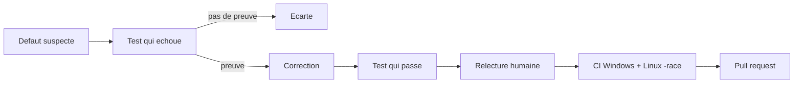

# Audit d'Open Code Review — septembre 2026

Cette page raconte un audit complet du projet [alibaba/open-code-review](https://github.com/alibaba/open-code-review) : ce que nous avons cherché, ce que nous avons trouvé, comment nous l'avons prouvé, et ce que nous avons proposé aux auteurs.

Elle est écrite pour deux lectorats. Les sections **En clair** s'adressent à tout le monde. Les sections **Détail technique** s'adressent aux développeurs.

**Résumé :** 45 défauts prouvés, 33 corrigés dans 24 pull requests, 6 failles de sécurité signalées en privé, 6 questions de conception ouvertes en 5 issues. Chaque correction est accompagnée d'un test qui échoue sans elle.

---

## 1. De quoi parle-t-on ?

### En clair

Open Code Review (commande `ocr`) est un outil d'Alibaba qui fait **relire du code par une intelligence artificielle**. Un développeur modifie un programme ; l'outil envoie ces modifications à un modèle d'IA, qui répond par des commentaires précis : « ici tu oublies de fermer un fichier », « là cette valeur peut déborder ». L'outil est utilisé par des dizaines de milliers de développeurs et s'intègre aux plateformes comme GitHub.

Sa particularité, c'est que **tout n'est pas confié à l'IA**. Les étapes qui ne doivent jamais se tromper (quels fichiers relire, quelles règles appliquer) sont faites par du code classique, prévisible. L'IA n'intervient que pour juger le code. C'est ce mélange qui fait sa fiabilité.

Notre audit a porté sur la partie code classique. Une erreur à ce niveau est invisible et grave : si l'outil oublie un fichier, personne ne s'en aperçoit, et le défaut passe en production.

### Détail technique

Le projet est écrit en Go (environ 60 000 lignes), avec une couverture de tests de 92 % et un seuil de 90 % imposé en intégration continue. L'architecture enchaîne : collecte du diff git, sélection et filtrage des fichiers, regroupement en lots, résolution des règles, boucle d'agent avec outils, placement des commentaires, filtrage des faux positifs, puis sortie en texte, JSON ou SARIF.

---

## 2. Pourquoi cet audit ?

### En clair

Le projet est jeune, très utilisé, et il touche à trois choses sensibles : **le code source** de ses utilisateurs, **les clés d'accès** aux services d'IA, et **les secrets** qui traînent dans un dépôt. Un défaut y coûte cher.

Nous avons commencé par installer et compiler l'outil, puis nous avons corrigé quelques problèmes rencontrés sous Windows. De fil en aiguille, nous avons décidé d'examiner méthodiquement l'ensemble.

### Détail technique

Périmètre : tout `internal/` et `cmd/`, plus le fichier `action.yml` de la GitHub Action. Cinq zones ont été auditées en parallèle, chacune par un agent dédié travaillant dans une copie isolée du dépôt :

| Zone | Contenu examiné |
|---|---|
| Diff et git | Collecte des diffs, `.gitignore`, découpage en hunks, placement des commentaires |
| LLM et configuration | Clients Anthropic, OpenAI, Bedrock, résolution des points d'accès, fuites de clés |
| Agent et boucle LLM | Regroupement, compression de l'historique, budgets, concurrence, reprise |
| Outils et sécurité | Lecture de fichiers, recherche, injection d'options git, GitHub Action |
| Sessions et sorties | Stockage des sessions, visualiseur web, SARIF, JSON, codes de sortie |

---

## 3. La méthode : aucune affirmation sans preuve

### En clair

La règle unique de cet audit : **un défaut n'existe que s'il est démontré**. Pas de « ce code semble suspect ». Pour chaque problème, il fallait écrire un petit programme de test qui échoue à cause du défaut, et qui réussit une fois corrigé.

Cette exigence a un effet secondaire précieux : elle **élimine les fausses alertes**. Plus de trente pistes ont été examinées puis abandonnées faute de preuve. Elles sont documentées comme telles, pour que personne ne recommence le même travail.

Ensuite, chaque correction a été **relue par un humain**, puis vérifiée par une reconstitution de l'intégration continue du projet.

### Détail technique

Chaîne de vérification appliquée à chaque correction :

1. Test de régression écrit dans le style du projet, exécuté **avant** la correction (il doit échouer) et **après** (il doit passer).
2. `make check` : en-têtes de licence, contrôle « anglais uniquement », `gofmt`, `go vet`, `go mod tidy`.
3. Suite complète sous Windows 11 (Go 1.27).
4. Suite complète dans un conteneur `golang:1.26.5` reproduisant le job Linux de la CI : `go test -race`, seuil de couverture à 90 %, compilation et test de fumée.
5. Fusion des 20 branches entre elles pour détecter les conflits.

Résultat : 15 exécutions de la CI Linux, toutes au vert, couverture de 91,4 % à 92,1 %.

---

## 4. Ce que nous avons trouvé

### En clair

Voici les défauts les plus parlants, traduits en conséquences concrètes.

| Le défaut | Ce que ça donnait en pratique |
|---|---|
| Les messages d'avertissement de git étaient lus comme des données | Une branche et une étiquette de même nom suffisaient à casser toute la relecture |
| Le filtrage des fichiers ignorés était approximatif | Sous Windows, des fichiers modifiés n'étaient jamais relus, sans que personne le sache |
| Les sessions de dépôts différents se mélangeaient | Reprendre une relecture pouvait charger les résultats d'un **autre** projet |
| La mémoire de l'IA était mal gérée | Le résultat que l'IA venait de demander pouvait être effacé juste avant qu'elle le lise |
| Un fichier renommé perdait ses commentaires | Le fichier était marqué « échoué » alors qu'il avait bien été relu |
| Les identifiants pouvaient s'afficher en clair | Un mot de passe dans une adresse se retrouvait dans les journaux d'exécution |
| Sous Windows, une commande d'installation bloquée | L'outil attendait indéfiniment, malgré son délai d'attente de 5 minutes |

### Détail technique

Les 33 défauts corrigés, par thème. Une pull request ne porte qu'un seul changement logique, comme le règlement du projet le demande :

| Thème | Défauts | Pull request |
|---|---|---|
| Sorties de git lues comme des données | `runGit`, `Runner.Run`, `getCommitMessage` et `scan` utilisaient la sortie combinée | [#1470](https://github.com/alibaba/open-code-review/pull/1470) |
| Filtrage `.gitignore` | `filepath.Match` sur Windows, motifs à barre médiane non ancrés, négations imbriquées ignorées, nom tronqué | [#1471](https://github.com/alibaba/open-code-review/pull/1471) |
| En-têtes de diff | Chemins protégés par des guillemets, chemins contenant ` b/` | [#1472](https://github.com/alibaba/open-code-review/pull/1472) |
| Compression de l'historique | Zone figée non décomptée, dernier tour résumé | [#1473](https://github.com/alibaba/open-code-review/pull/1473) |
| Arrêt d'un tour tardif | Un arrêt au tour 2 marquait « échoués » des fichiers relus au tour 1 | [#1474](https://github.com/alibaba/open-code-review/pull/1474) |
| Fichier renommé | Le commentaire restait classé sous l'ancien nom | [#1502](https://github.com/alibaba/open-code-review/pull/1502) |
| Commentaire sans fichier | Il sortait avec la clé du groupe comme chemin | [#1503](https://github.com/alibaba/open-code-review/pull/1503) |
| Isolation des sessions | Collision d'encodage, chemins UNC | [#1475](https://github.com/alibaba/open-code-review/pull/1475) |
| Budget des groupes | Surcoût du prompt non compté | [#1476](https://github.com/alibaba/open-code-review/pull/1476) |
| Accolades imbriquées | `expandBraces` cassait `{a,{b,c}}` | [#1477](https://github.com/alibaba/open-code-review/pull/1477) |
| Scan repris | Résultats réutilisés perdus | [#1478](https://github.com/alibaba/open-code-review/pull/1478) |
| URL Anthropic | `/v1` devenait `/v1/v1/messages` | [#1479](https://github.com/alibaba/open-code-review/pull/1479) |
| En-têtes HTTP | Fusion sensible à la casse, en-têtes réservés contournables | [#1480](https://github.com/alibaba/open-code-review/pull/1480) |
| Nom de fournisseur vide | `config set provider ""` créait un fournisseur sans nom | [#1481](https://github.com/alibaba/open-code-review/pull/1481) |
| Télémétrie désactivable | `OCR_ENABLE_TELEMETRY=0` restait sans effet | [#1504](https://github.com/alibaba/open-code-review/pull/1504) |
| Encodage des sorties | URI SARIF, `null` en JSON, troncature UTF-8 | [#1482](https://github.com/alibaba/open-code-review/pull/1482) |
| Guillemets Windows | Scripts `setup` MCP mutilés par `cmd.exe` | [#1483](https://github.com/alibaba/open-code-review/pull/1483) |

Sept autres corrections, issues d'une première passe sur Windows, ont été proposées avant l'audit : [#1430](https://github.com/alibaba/open-code-review/pull/1430) (processus survivant à son délai d'attente), [#1431](https://github.com/alibaba/open-code-review/pull/1431) (noms de fichiers accentués dans `file_find`), [#1505](https://github.com/alibaba/open-code-review/pull/1505) (retour chariot en trop dans `code_search`), [#1432](https://github.com/alibaba/open-code-review/pull/1432) (lignes vides dans le placement des commentaires), [#1433](https://github.com/alibaba/open-code-review/pull/1433) (métriques comptées deux fois), [#1434](https://github.com/alibaba/open-code-review/pull/1434) (écriture atomique du fichier de configuration), [#1435](https://github.com/alibaba/open-code-review/pull/1435) (suppression de code mort).

**Note sur le découpage.** Trois pull requests regroupaient plusieurs correctifs sans lien entre eux. Elles ont été découpées, car le règlement demande un seul changement logique par pull request : #1474 a donné #1502 et #1503, #1481 a donné #1504, et #1431 a donné #1505. La vérification a porté sur un point précis : la réunion des morceaux reproduit exactement le contenu d'origine, sans rien perdre.

---

## 5. Les failles de sécurité

### En clair

L'audit a mis au jour **6 failles**. Elles ne sont pas décrites en détail ici : elles ne sont pas encore corrigées, et publier leur mode d'emploi mettrait en danger les utilisateurs de l'outil. Elles ont été signalées **en privé** à Alibaba, comme leur politique de sécurité le demande.

Voici tout de même de quoi il s'agit, sans donner les clés :

| Nature | Qui est concerné |
|---|---|
| Des fichiers censés rester secrets peuvent être transmis au modèle d'IA | Tout dépôt contenant un fichier de secrets |
| Certains fichiers sensibles du dépôt restent lisibles par les outils de l'agent | Les relectures lancées sur un poste de travail |
| Des identifiants peuvent apparaître en clair dans l'affichage | Les utilisateurs dont l'adresse de service contient un mot de passe |
| Des en-têtes secrets sont affichés sans masquage | Les utilisateurs de passerelles d'entreprise |
| Un raccourci de dossier Windows contourne une protection | Windows uniquement, avec un raccourci créé localement |
| La sortie des outils n'est pas bornée en taille | Coût et mémoire, sur un dépôt contenant un très gros fichier |

Cette page sera complétée quand Alibaba aura corrigé et publié son avis de sécurité.

### Détail technique

Le signalement suit [SECURITY.md](https://github.com/alibaba/open-code-review/blob/main/.github/SECURITY.md) : GitHub Private Vulnerability Reporting, description, reproduction, versions affectées, correction suggérée, et déclaration de l'usage de l'IA avec les prompts.

Le modèle de menace retenu : **le dépôt relu et la sortie du modèle sont hostiles**. C'est le cas réel d'une pull request venant de l'extérieur, relue automatiquement par la CI. Dans ce cadre, une instruction cachée dans le code relu (*prompt injection*) est une entrée d'attaque légitime, pas une hypothèse d'école.

---

## 6. Questions de conception

Cinq points ne sont pas des défauts mais des choix qui appartiennent aux auteurs. Ils ont été ouverts en issues plutôt qu'en pull requests :

- [#1463](https://github.com/alibaba/open-code-review/issues/1463) — séparateurs Windows dans les motifs d'exclusion
- [#1484](https://github.com/alibaba/open-code-review/issues/1484) — `ocr llm test` ne teste pas le même fichier de configuration que `ocr review`
- [#1485](https://github.com/alibaba/open-code-review/issues/1485) — `config set` supprime les clés qu'il ne connaît pas
- [#1486](https://github.com/alibaba/open-code-review/issues/1486) — numéro de ligne d'un code supprimé, sans indication de côté
- [#1487](https://github.com/alibaba/open-code-review/issues/1487) — les modes `--from/--to` et `--commit` utilisent le `.gitignore` du répertoire de travail

---

## 7. Ce qu'il faut retenir

### En clair

Un outil de relecture par IA n'est pas qu'un modèle d'IA. **La plomberie compte autant**, et c'est là que se logeaient la plupart des défauts : dans la lecture des sorties de git, dans le filtrage des fichiers, dans la gestion de la mémoire. Aucun de ces défauts n'était visible à l'usage. Ils se traduisaient par des relectures silencieusement incomplètes, ce qui est le pire des cas pour un outil censé détecter des erreurs.

### Détail technique

Trois motifs récurrents, transposables à d'autres projets :

1. **Ne jamais mélanger la sortie normale d'un programme et ses messages d'erreur** quand on lit la première comme une donnée. Le projet le savait, il avait même écrit une fonction pour ça, mais tous les appels n'avaient pas été convertis.
2. **Ne pas réimplémenter les règles d'un outil existant.** Le filtrage `.gitignore` maison divergeait de git sur quatre points. La correction consiste à poser la question à git lui-même.
3. **Les différences entre systèmes se cachent dans les détails.** `filepath.Match` contre `path.Match`, l'échappement des guillemets de `cmd.exe`, les jonctions Windows, les fins de ligne CRLF : autant de défauts invisibles depuis Linux.

---

## Transparence sur l'usage de l'IA

Cet audit a été mené avec Claude Code (modèle Claude Opus 5), sous supervision humaine. La méthode imposait qu'aucun défaut ne soit retenu sans un test le prouvant, et chaque correction a été relue avant d'être proposée. Chaque pull request et chaque issue le mentionne explicitement, comme le demande le règlement du projet.

Aucun commit ne porte de signature d'IA : le règlement l'interdit, et la responsabilité du contenu proposé revient à la personne qui le soumet.
